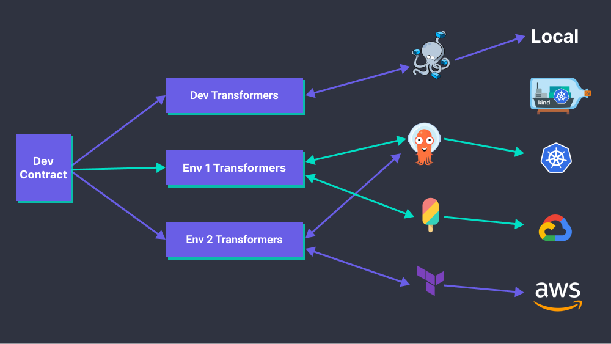

# Concepts

The goal is to be able to define developer-centric configurations using a single file for all envrionments, for all vendors!

## Stacks
A stack is how you define your workloads and its dependencies. The stack is a contract between developers and platform designers.

### Components

[TODO]

### Traits

[TODO]

## Transformers

[TODO]