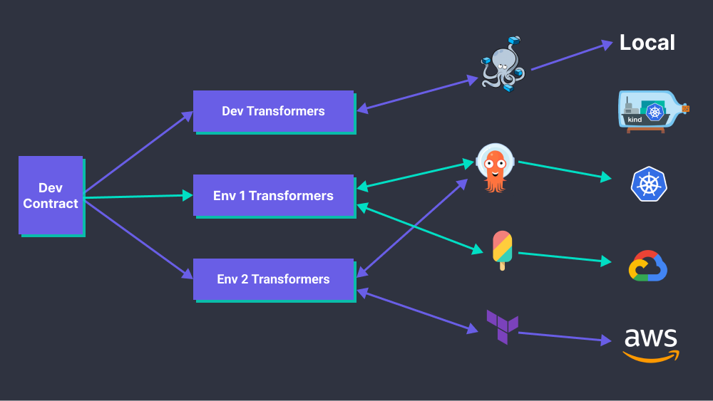

# Introduction

DevX helps you define your own infrastructure abstractions. Why? so you don't have to write Kubernetes manifests, deal with Helm values, Terraform code, and Docker Compose manifests.

Engineering teams started scaling DevOps by building internal developer platforms (IDPs). IDPs allow developers to self-serve their infrastructure needs. But there are no standards (yet) on how these platforms are built. How do we make IDPs evolve without slowing down developers?

You can use DevX to build code-based developer interfaces for your IDP. Developers can create all the infrastructure they need, using a single tool, without leaving their code editor.



## Configuration language
We use [CUE](https://cuelang.org/) to write strongly typed configurations. You can now shift YAML typos left, instead of detecting errors after applying configurations.

[CUE](https://cuelang.org/) is the result of years of experience writing configuration languages at Google, and seeks to improve the developer experience while avoiding some nasty pitfalls. CUE looks like JSON, while making declarative data definition, generation, and validation a breeze. You can find a primer on CUE [here](https://docs.dagger.io/1215/what-is-cue/#understanding-cue).

:::tip
You can [use YAML to define devx stacks](/docs/examples/yaml).
We internally convert your YAML stacks to CUE for processing.
:::

## Getting Started


### Install devx from the [releases page](https://github.com/devopzilla/guku-devx/releases)


### Init the project
```bash
➜ mkdir myapp
➜ cd myapp
➜ devx project init
```

### Update project dependencies
```bash
➜ devx project update
```

### Generate example
```bash
➜ devx project gen
```

This will generate a sample DevX stack and builder. You create a stack to define your workload and what it needs to run.
```cue title="stack.cue"
package main

import (
	"guku.io/devx/v1"
	"guku.io/devx/v1/traits"
)

stack: v1.#Stack & {
	components: {
		cowsay: {
			traits.#Workload
			containers: default: {
				image: "docker/whalesay"
				command: ["cowsay"]
				args: ["Hello DevX!"]
			}
		}
	}
}
```

You create a builder to tel DevX how to transform your stack configurations to the final deployable infrastructure as code. This step will usually be performed by platform teams or developers wishing to extend the platform.
```cue title="builder.cue"
package main

import (
	"guku.io/devx/v1"
	"guku.io/devx/v1/transformers/compose"
)

builders: v1.#StackBuilder & {
	dev: {
		mainflows: [
			v1.#Flow & {
				pipeline: [compose.#AddComposeService]
			},
		]
	}
}	
```


### Build configurations for the dev environment
```bash
➜ devx build dev
🏗️  Loading stack...
👀 Validating stack...
🏭 Transforming stack 100% |████████████████████████| (1/1, 711 it/s)        
[compose] applied resources to "build/dev/compose/docker-compose.yml"
```
```yaml title="build/dev/compose/docker-compose.yml"
version: "3"
volumes: {}
services:
  cowsay:
    image: docker/whalesay
    environment: {}
    depends_on: []
    command:
      - cowsay
      - Hello DevX!
    restart: always
    volumes: []
```

No we run the compose file
```bash
➜ docker-compose -f build/dev/compose/docker-compose.yml up
[+] Running 1/0
 ⠿ Container compose-cowsay-1  Created                                                                                                  0.0s
Attaching to compose-cowsay-1
compose-cowsay-1  |  _____________ 
compose-cowsay-1  | < Hello DevX! >
compose-cowsay-1  |  ------------- 
compose-cowsay-1  |     \
compose-cowsay-1  |      \
compose-cowsay-1  |       \     
compose-cowsay-1  |                     ##        .            
compose-cowsay-1  |               ## ## ##       ==            
compose-cowsay-1  |            ## ## ## ##      ===            
compose-cowsay-1  |        /""""""""""""""""___/ ===        
compose-cowsay-1  |   ~~~ {~~ ~~~~ ~~~ ~~~~ ~~ ~ /  ===- ~~~   
compose-cowsay-1  |        \______ o          __/            
compose-cowsay-1  |         \    \        __/             
compose-cowsay-1  |           \____\______/   
compose-cowsay-1 exited with code 0
```