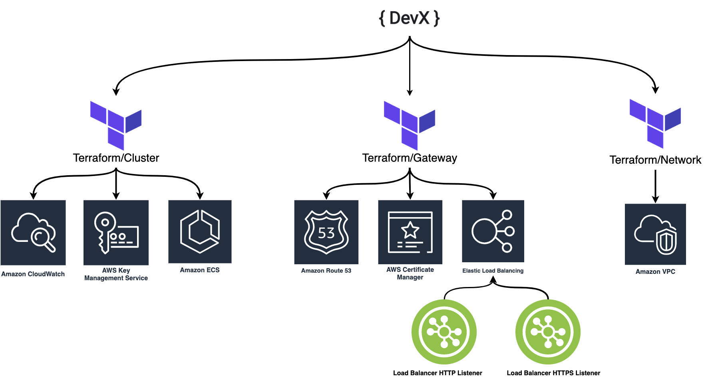
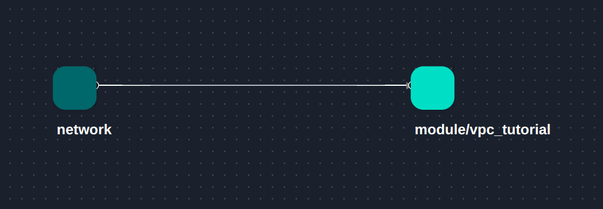
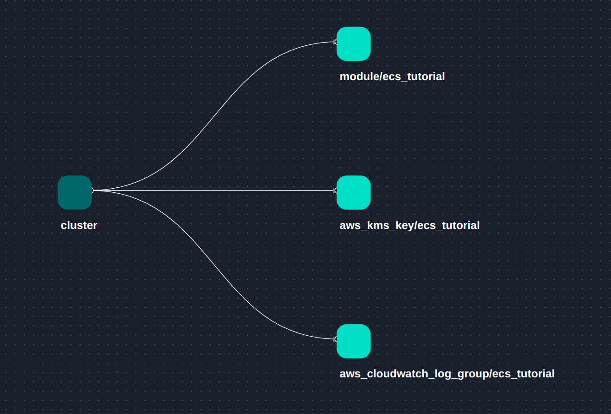
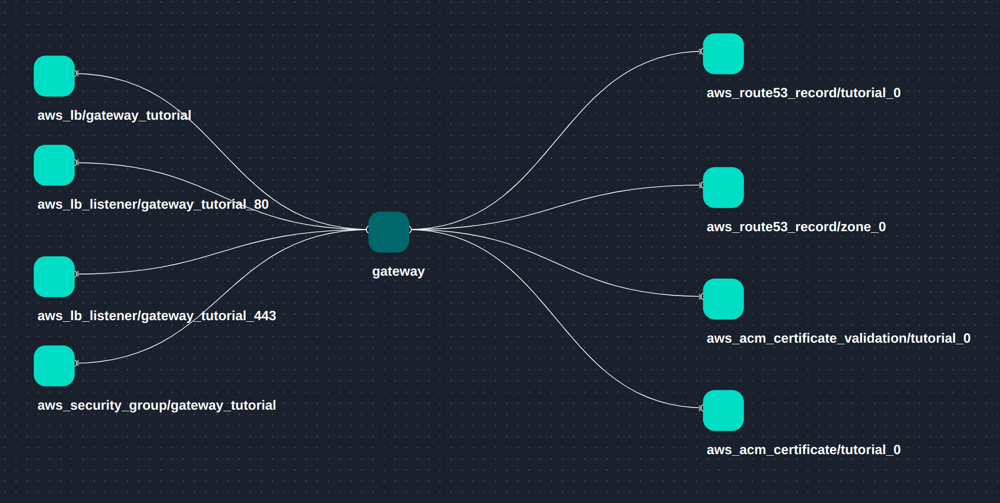
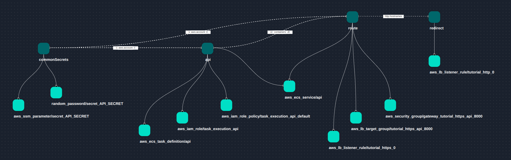

import TOCInline from '@theme/TOCInline';

# Building production-grade infrastructure on AWS Elastic Container Service

In this tutorial you'll use devx to generate Terraform IaC with security best-practices to run workloads on AWS.




Things you get out of the box:
+ secrets management with SSM parameter store or secrets manager
+ least privilege ECS task IAM policies
+ buttoned up security groups
+ TLS configuration for application loadbalancer
+ task logging with cloudwatch
+ application loadbalancer healthchecks


Sections:
<TOCInline toc={toc} minHeadingLevel={2} maxHeadingLevel={2}/>

## Prerequisites

+ devx is installed on your machine
    Use homebrew
    ```bash
    brew tap devopzilla/guku-devx
    brew install guku-devx       
    ```

    Or

    download the latest [binary](https://github.com/devopzilla/guku-devx/releases)

+ AWS cli configured on your machine

    You have to make sure your Terraform IAM role/user have enough permissions to manage ECS clusters, ALBs, Security Groups, SSM Parameters, VPCs, Subnets, IAM Roles, IAM Policies, etc...

    If you're just trying this out, make sure you're using an empty account and give Terraform Administrator Access, but in production you have to reduce the permission to just what you need.

+ AWS Route53 is managing your domain

+ Terraform and Git are installed on your machine


## Building your infrastructure (Platform Engineers)

This project will house the definitions of common infrastructure components like your VPC, and any configurations that you want to be re-usable by your developers.

### 1) Create a new project
```bash
mkdir platform
cd platform
devx project init
```

update your module name
```cue title="./cue.mod/module.cue"
// Add your own module name
module: "devopzilla.com"
packages: [
    // You can optionally pin dependencies to a specific git tag or commit
	"github.com/devopzilla/guku-devx-catalog@main:",
]
```

install dependencies

```bash
devx project update
```

### 2) Create a VPC, Cluster, and ALB

You first have to create a stack

```bash
touch stack.cue
```

```cue title="./stack.cue"
package main

import (
	"guku.io/devx/v1"
	"guku.io/devx/v1/traits"
)

stack: v1.#Stack & {
	$metadata: stack: "infra"
	components: {
        // Virtual private network
		network: {
			traits.#VPC
			vpc: {
				name: "tutorial"
				cidr: "10.0.0.0/16"
				subnets: {
					private: ["10.0.1.0/24", "10.0.2.0/24"]
					public: ["10.0.101.0/24", "10.0.102.0/24"]
				}
			}
		}

        // ECS cluster
		cluster: {
			traits.#ECS
			ecs: {
				name: "tutorial"
				capacityProviders: fargateSpot: enabled: true
			}
		}

        // Application load balancer
		gateway: {
			traits.#Gateway
			gateway: {
				name:   "tutorial"
				public: true

                // Replace this with you own domains
                // You have to move your domain name servers to Route53 for this to work
				addresses: [
					"tutorial-aws-ecs.guku.io",
				]

                // We want our gateway to listen on port 80 and 443
				listeners: {
					http: {
						port:     80
						protocol: "HTTP"
					}
					https: {
						port:     443
						protocol: "HTTPS"
					}
				}
			}
		}
	}
}
```

then tell devx how to build this stack for the `prod` environment
```bash
touch builder.cue
```

```cue title="./builder.cue"
package main

import (
	"guku.io/devx/v2alpha1"
    tf "guku.io/devx/v1/transformers/terraform"
	"guku.io/devx/v1/transformers/terraform/aws"
)

builders: v2alpha1.#Environments & {
	prod: {
        // Set terraform output directory to "./deploy"
		drivers: terraform: output: dir: ["deploy"]

		components: {
            // Add this component to configure the generated Terraform AWS providers
			tfprovider: {
                // This reserved field contains all the low-level resources
				$resources: {
                    // The name of the resource doesn't matter
                    // We use the tf.#Terraform schema to make sure we define valid Terraform configurations
                    terraform: tf.#Terraform & {
                        provider: aws: region: "us-west-1"
                    }
                }
			}

            // The aws.#AddGateway transformer requires vpc data as input
            // We set the vpc here because we cannot reference external components from within a transformer
            network: _
			gateway: aws: vpc: network
		}

		flows: {
            // This flow expects a VPC trait and generates Terraform code to add an AWS VPC
			"terraform/add-vpc": pipeline: [aws.#AddVPC]

            // This flow expects an ECS trait and generates Terraform code to add an AWS ECS cluster
			"terraform/add-ec-cluster": pipeline: [aws.#AddECS]

            // This flow expects an Gateway trait and generates Terraform code to add an AWS ALB
			"terraform/add-gateway": pipeline: [aws.#AddGateway & {
                // Allow the transformer to create Route53 DNS records
				createDNS: true

                // Allow the transformer to create TLS certificates
				createTLS: true
			}]
		}
	}
}
```

### 3) Generate configurations

```bash
devx build prod
```

:::tip
You can use the `-S` flag to enable strict mode.
Strict mode makes sure all your stack components are handled by the builder.
:::

Terraform resources generated for the network:


Terraform resources generated for the cluster:


Terraform resources generated for the gateway:


### 4) Apply configurations

```bash
cd deploy
terraform init
terraform plan
```

if all looks good

```bash
terraform apply --auto-approve
```
```bash
> Apply complete! Resources: 28 added, 0 changed, 0 destroyed.
```

### 5) Environment builders

Define the builders that your developers will use to build their configurations.

```bash
cd ..
mkdir platform
touch platform/platform.cue
```

```cue title="./platform/platform.cue"
package platform

import (
	"guku.io/devx/v2alpha1"
	"guku.io/devx/v2alpha1/environments"
	"guku.io/devx/v1/transformers/terraform/aws"
	infra "devopzilla.com:main"
)

Builders: v2alpha1.#Environments & {
	prod: environments.#ECS & {
		drivers: terraform: output: dir: ["deploy"]
		config: {
			aws: {
                // Add your AWS region
				region:  "us-west-1"

                // Add your AWS account id
				account: "000000000000"
			}
			vpc: name: infra.stack.components.network.vpc.name
			ecs: {
				name:       infra.stack.components.cluster.ecs.name
				launchType: "FARGATE"
			}
            secrets: service: "ParameterStore"
			gateway: infra.stack.components.gateway.gateway
		}

        // Add this component to configure the generated Terraform AWS providers
        // We re-use the provider definition of our infra stack
        components: tfprovider: infra.builders.prod.components.tfprovider

        // Add an extra flow to auto-generate secrets in SSM parameter store
        // The aws.#AddSSMSecretParameter transformer use random_password to generate a 32-character string
        flows: "terraform/autogenerate-secrets": pipeline: [aws.#AddSSMSecretParameter]
	}
}
```

:::caution
Make sure to set your AWS account id.
:::

### 6) Commit and push your code

```bash
git init
cat > .gitignore <<EOL
cue.mod/pkg
deploy/.terraform
deploy/terraform.tfstate
EOL
git add .
git commit -m "init devx"
git remote add origin https://github.com/devopzilla/devxtut-aws-ecs.git
git branch -M main
git push -u origin main
```

## Deploying apps (Developers)

### 1) Create a new project
```bash
mkdir myapp
cd myapp
devx project init
```

update your module name and add your platform repository as a dependency
```cue title="./cue.mod/module.cue"
// Add your own module name
module: "devopzilla.com/app/api"
packages: [
    // You can optionally pin dependencies to a specific git tag or commit
	"github.com/devopzilla/guku-devx-catalog@main:",

    // Your platform repository
    "github.com/devopzilla/devxtut-aws-ecs@main:",
]
```

install dependencies

```bash
devx project update
```

### 2) Define what your service needs

We create a stack for our service

```bash
touch stack.cue
```

```cue title="./stack.cue"
package main

import (
	"guku.io/devx/v1"
	"guku.io/devx/v1/traits"
	"devopzilla.com/platform"
)

stack: v1.#Stack & {
	$metadata: stack: "devopzilla.com/apps/api"

    // Components can be workloads, resources, CI pipeline etc...
	components: {
        // Add secrets
		commonSecrets: {
            // The Secret trait let's you add references to your secrets
			traits.#Secret
			secrets: apisecret: name: "API_SECRET"
		}

        // Define your workload
		api: {
            // The Workload trait runs some containers
			traits.#Workload
			containers: default: {
				image: "hashicorp/http-echo"
                command: ["-listen=:8000", "-text=hello"]
				resources: requests: {
					cpu:    "256m"
					memory: "512M"
				}
				env: {
					API_SECRET:     commonSecrets.secrets.apisecret
					NAME:    "Devopzilla API"
				}
			}

            // The Exposable trait exposes ports on your containers
            traits.#Exposable
			endpoints: default: ports: [
				{
					port:   8000
				},
			]
		}

        // Expose your workloads through a public HTTPS ingress
		route: {
            // The HTTPRoute trait exposes some endpoints through your ingress gateway
			traits.#HTTPRoute
			http: {
				listener: "https"
				hostnames: [
					"tutorial-aws-ecs.guku.io",
				]
				rules: [{
					match: path: "/*"
					backends: [
						{
							name:       "api"
							endpoint:   api.endpoints.default
							containers: api.containers
							port:       8000
						},
					]
				}]
			}
		}

        // Redirect HTTP traffic to HTTPS
        redirect: {
			traits.#HTTPRoute
			http: {
				listener: "http"
				hostnames: route.http.hostnames
				rules: [{
					match: path: "/*"
					redirect: {
						scheme: "https"
						port:   443
					}
				}]
			}
		}
	}
}

// Use the central platform builders
builders: platform.Builders
```

### 3) Generate configurations

```bash
devx build prod
```

:::tip
You can use the `-S` flag to enable strict mode.
Strict mode makes sure all your stack components are handled by the builder.
:::

Terraform resources generated for the stack:


### 4) Apply configurations

```bash
cd deploy
terraform init
terraform plan
```

if all looks good

```bash
terraform apply --auto-approve
```
```bash
> Apply complete! Resources: 10 added, 0 changed, 0 destroyed.
```

### 5) Test the workload

```bash
curl "https://tutorial-aws-ecs.guku.io"
```
```bash
> hello
```

## Clean up

### Destroy the workload
```bash
cd myapp/deploy
terraform destroy --auto-approve
```
```bash
> Destroy complete! Resources: 10 destroyed.
```

### Destroy the infrastructure
```bash
cd platform/deploy
terraform destroy --auto-approve
```
```bash
> Destroy complete! Resources: 28 destroyed.
```

## Why not just use Terraform modules?

1) Stack definitions are technology-agnostic. You don't have to know much about ECS to deploy a workload, and if you swap transformers you will be able to deploy with Docker Compose, or even Kubernetes

2) You can package and re-use other types of configurations in devx modules e.g. CI pipelines, policies, workflows, shared variables, validation rules, and application configurations

3) Nested configurations like the task definition are validated much earlier at generation
